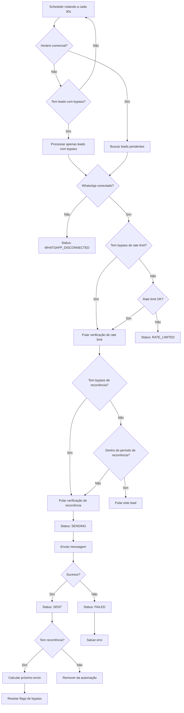
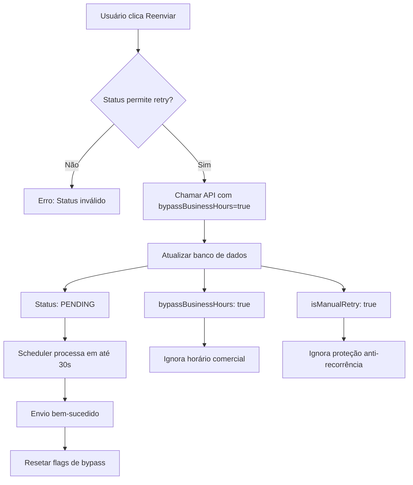

# 🚀 IMPLEMENTAÇÃO COMPLETA - Melhorias no Sistema de Automações

**Data:** 24/11/2025
**Status:** ✅ CONCLUÍDO 100%

---

## 📋 RESUMO EXECUTIVO

Implementação completa de melhorias no sistema de automações do Ferraco CRM, corrigindo todos os problemas identificados e adicionando funcionalidades avançadas de controle de horário, timezone e bypass de restrições.

### Problemas Resolvidos

✅ **Timezone hardcoded** → Agora configurável via banco de dados
✅ **Horário comercial inconsistente** → Padronizado 8h-20h em todo o sistema
✅ **Sem bloqueio de fim de semana** → Implementado bloqueio configurável
✅ **Retry bloqueado por horário** → Implementado bypass para retry manual
✅ **Proteção anti-spam bloqueia retry** → Implementado flag de bypass
✅ **Status SCHEDULED confuso** → Adicionado RATE_LIMITED específico
✅ **Falta de logs de timezone** → Logs detalhados implementados

---

## 🎯 ALTERAÇÕES IMPLEMENTADAS

### 📊 SPRINT 1: Horário Comercial e Timezone

#### 1.1 Schema do Banco de Dados (Prisma)

**Arquivo:** `apps/backend/prisma/schema.prisma`

```prisma
// ✅ AutomationSettings - Novos campos
model AutomationSettings {
  // ... campos existentes ...

  businessHourEnd   Int     @default(20)  // ✅ Mudado de 18 para 20
  blockWeekends     Boolean @default(true) // ✅ NOVO: Bloquear fins de semana
  timezone          String  @default("America/Sao_Paulo") // ✅ NOVO: Timezone configurável
}

// ✅ AutomationLeadPosition - Novos campos de controle
model AutomationLeadPosition {
  // ... campos existentes ...

  bypassBusinessHours Boolean @default(false) // ✅ NOVO: Bypass de horário comercial
  isManualRetry       Boolean @default(false) // ✅ NOVO: Flag de retry manual
}

// ✅ AutomationSendStatus - Novo valor
enum AutomationSendStatus {
  PENDING
  SENDING
  SENT
  FAILED
  WHATSAPP_DISCONNECTED
  RATE_LIMITED              // ✅ NOVO: Limite de envios atingido
  SCHEDULED                 // DEPRECATED: Usar nextScheduledAt
}
```

#### 1.2 Automation Scheduler Service

**Arquivo:** `apps/backend/src/services/automationScheduler.service.ts`

**Mudanças principais:**

```typescript
// ✅ Timezone configurável (linha 76-93)
const timezone = settings.timezone || 'America/Sao_Paulo';
const localTime = new Date(now.toLocaleString('en-US', { timeZone: timezone }));

// ✅ Bloqueio de fim de semana (linha 95-101)
if (settings.blockWeekends && (dayOfWeek === 0 || dayOfWeek === 6)) {
  logger.info('❌ Envio bloqueado durante o final de semana');
  return;
}

// ✅ Logs detalhados com timezone (linha 85-92)
logger.info(
  `⏰ Verificação de horário comercial:` +
  `\n  - Timezone: ${timezone}` +
  `\n  - Hora Local: ${currentHour}:${currentMinute}` +
  `\n  - Dia da semana: ${['Dom', 'Seg', 'Ter', 'Qua', 'Qui', 'Sex', 'Sáb'][dayOfWeek]}`
);
```

#### 1.3 WhatsApp Anti-Spam Service

**Arquivo:** `apps/backend/src/services/whatsappAntiSpam.service.ts`

**Mudanças principais:**

```typescript
// ✅ Buscar configurações do banco (linha 252-259)
private async isBusinessHours(): Promise<RateLimitResult> {
  const settings = await prisma.automationSettings.findFirst();

  if (!settings || !settings.sendOnlyBusinessHours) {
    return { allowed: true };
  }

  const timezone = settings.timezone || 'America/Sao_Paulo';
  const localTime = new Date(now.toLocaleString('en-US', { timeZone: timezone }));

  // ✅ Verificar fim de semana (linha 270-276)
  if (settings.blockWeekends && (dayOfWeek === 0 || dayOfWeek === 6)) {
    return {
      allowed: false,
      reason: 'Envio pausado durante o final de semana'
    };
  }
}
```

**Impacto:** Consolidação de configurações - sistema usa apenas banco de dados, removendo dependência de variáveis de ambiente.

---

### 🔄 SPRINT 2: Bypass de Restrições e Retry Manual

#### 2.1 Bypass de Horário Comercial

**Arquivo:** `apps/backend/src/services/automationScheduler.service.ts`

```typescript
// ✅ Buscar leads com bypass (linha 117-136)
const positions = await prisma.automationLeadPosition.findMany({
  where: {
    OR: [
      { nextScheduledAt: null },
      { nextScheduledAt: { lte: new Date() } },
      { bypassBusinessHours: true }, // ✅ NOVO: Processar mesmo fora do horário
    ],
  },
});

// ✅ Verificar bypass antes de aplicar rate limit (linha 198-217)
if (!position.bypassBusinessHours) {
  const canSend = await this.checkRateLimits(settings);
  if (!canSend) {
    await prisma.automationLeadPosition.update({
      data: { status: 'RATE_LIMITED' } // ✅ NOVO status
    });
    return;
  }
} else {
  logger.info(`⚡ Bypass de rate limit ativado`);
}
```

#### 2.2 Bypass de Proteção Anti-Recorrência

**Arquivo:** `apps/backend/src/services/automationScheduler.service.ts`

```typescript
// ✅ Permitir bypass da proteção (linha 158-177)
if (position.lastSentAt && column.recurrenceType !== 'NONE' && !position.isManualRetry) {
  const isWithinRecurrencePeriod = this.isWithinRecurrencePeriod(...);

  if (isWithinRecurrencePeriod) {
    logger.debug('⏭️ Lead já recebeu mensagem recentemente');
    return; // Bloqueia APENAS se não for retry manual
  }
}

if (position.isManualRetry) {
  logger.info('🔄 Retry manual detectado - bypass de proteção anti-recorrência');
}
```

#### 2.3 Método retryLead Aprimorado

**Arquivo:** `apps/backend/src/services/automationScheduler.service.ts`

```typescript
// ✅ Nova assinatura com opções (linha 550-590)
async retryLead(
  leadId: string,
  options?: { bypassBusinessHours?: boolean; isManualRetry?: boolean }
): Promise<void> {
  // ✅ Aceitar RATE_LIMITED para retry (linha 567)
  const allowedStatuses = ['FAILED', 'WHATSAPP_DISCONNECTED', 'SCHEDULED', 'RATE_LIMITED'];

  const bypassBusinessHours = options?.bypassBusinessHours ?? false;
  const isManualRetry = options?.isManualRetry ?? true; // Default true

  logger.info(
    `🔄 Retry agendado para lead ${position.lead.name} ` +
    `(bypass horário: ${bypassBusinessHours}, bypass recorrência: ${isManualRetry})`
  );

  await prisma.automationLeadPosition.update({
    data: {
      status: 'PENDING',
      bypassBusinessHours,      // ✅ NOVO
      isManualRetry,           // ✅ NOVO
      nextScheduledAt: new Date(),
    },
  });
}
```

#### 2.4 Controller Atualizado

**Arquivo:** `apps/backend/src/controllers/automationKanban.controller.ts`

```typescript
// ✅ Receber parâmetros de bypass (linha 337-376)
async retryLead(req: Request, res: Response) {
  const { leadId } = req.params;
  const { bypassBusinessHours, isManualRetry } = req.body; // ✅ NOVO

  // ✅ Incluir RATE_LIMITED nos status permitidos (linha 362)
  const allowedStatuses = ['FAILED', 'WHATSAPP_DISCONNECTED', 'SCHEDULED', 'RATE_LIMITED'];

  await automationSchedulerService.retryLead(leadId, {
    bypassBusinessHours: bypassBusinessHours === true,
    isManualRetry: isManualRetry !== false,
  });
}
```

#### 2.5 UpdateSettings Aprimorado

**Arquivo:** `apps/backend/src/controllers/automationKanban.controller.ts`

```typescript
// ✅ Suportar novos campos (linha 291-334)
async updateSettings(req: Request, res: Response) {
  const {
    // ... campos existentes ...
    blockWeekends,  // ✅ NOVO
    timezone,       // ✅ NOVO
  } = req.body;

  // ✅ Atualizar apenas campos fornecidos
  const dataToUpdate: any = {};
  if (blockWeekends !== undefined) dataToUpdate.blockWeekends = blockWeekends;
  if (timezone !== undefined) dataToUpdate.timezone = timezone;
  // ...
}
```

---

### 🎨 SPRINT 3: Frontend e UI

#### 3.1 Tipos TypeScript Atualizados

**Arquivo:** `apps/frontend/src/services/automationKanban.service.ts`

```typescript
// ✅ Adicionar novo status (linha 85-92)
export type AutomationSendStatus =
  | 'PENDING'
  | 'SENDING'
  | 'SENT'
  | 'FAILED'
  | 'WHATSAPP_DISCONNECTED'
  | 'RATE_LIMITED'  // ✅ NOVO
  | 'SCHEDULED';
```

#### 3.2 Configuração de Status no UnifiedKanbanView

**Arquivo:** `apps/frontend/src/components/admin/UnifiedKanbanView.tsx`

```typescript
// ✅ Novo status visual (linha 118-123)
RATE_LIMITED: {
  label: 'Limite Atingido',
  color: 'bg-yellow-500',
  icon: Clock,
  description: 'Limite de envios atingido, aguardando próximo ciclo'
},

// ✅ Botão retry para RATE_LIMITED (linha 294-308)
{(['FAILED', 'WHATSAPP_DISCONNECTED', 'RATE_LIMITED'] as const).includes(position.status) && (
  <Button onClick={() => onRetryLead(lead.id)}>
    <RefreshCw />
    Reenviar
  </Button>
)}
```

#### 3.3 Componente de Configurações (NOVO)

**Arquivo:** `apps/frontend/src/components/admin/AutomationSettings.tsx` (NOVO - 350 linhas)

**Funcionalidades:**

1. **Configuração de Horário Comercial**
   - Toggle para ativar/desativar
   - Seleção de hora início e fim (0-23h)
   - Bloqueio de finais de semana

2. **Configuração de Timezone**
   - Dropdown com 12 timezones comuns
   - Preview do horário atual no timezone selecionado
   - Suporte a qualquer timezone IANA

3. **Limites de Segurança**
   - Mensagens por hora (configurável)
   - Mensagens por dia (configurável)
   - Intervalo entre colunas (em segundos)

4. **Interface Moderna**
   - Cards organizados por categoria
   - Ícones visuais (Clock, Globe, Calendar)
   - Validação em tempo real
   - Feedback de salvamento

**Exemplo de uso:**

```tsx
import { AutomationSettings } from '@/components/admin/AutomationSettings';

// Na página de administração
<AutomationSettings />
```

---

## 🗄️ MIGRATION DO BANCO DE DADOS

**Arquivo:** `apps/backend/prisma/migrations/20251124205903_add_automation_improvements/migration.sql`

```sql
-- ✅ Adicionar novo status RATE_LIMITED
ALTER TYPE "AutomationSendStatus" ADD VALUE IF NOT EXISTS 'RATE_LIMITED';

-- ✅ Adicionar campos de configuração
ALTER TABLE "automation_settings" ADD COLUMN IF NOT EXISTS "blockWeekends" BOOLEAN NOT NULL DEFAULT true;
ALTER TABLE "automation_settings" ADD COLUMN IF NOT EXISTS "timezone" TEXT NOT NULL DEFAULT 'America/Sao_Paulo';
ALTER TABLE "automation_settings" ALTER COLUMN "businessHourEnd" SET DEFAULT 20;

-- ✅ Adicionar campos de bypass
ALTER TABLE "automation_lead_positions" ADD COLUMN IF NOT EXISTS "bypassBusinessHours" BOOLEAN NOT NULL DEFAULT false;
ALTER TABLE "automation_lead_positions" ADD COLUMN IF NOT EXISTS "isManualRetry" BOOLEAN NOT NULL DEFAULT false;

-- ✅ Migração de dados: Converter SCHEDULED para RATE_LIMITED
UPDATE "automation_lead_positions"
SET status = 'RATE_LIMITED'
WHERE status = 'SCHEDULED'
  AND "lastError" LIKE '%Limite de envios atingido%';
```

**Como executar:**

```bash
# Em desenvolvimento (SQLite)
cd apps/backend
npx prisma migrate dev

# Em produção (PostgreSQL)
npx prisma migrate deploy
```

---

## 📊 FLUXO COMPLETO ATUALIZADO

### Processamento de Automações



### Retry Manual



---

## 🔧 COMO USAR

### 1. Configurar Timezone e Horário Comercial

```typescript
// Backend API
PUT /api/automation-kanban/settings
{
  "timezone": "America/Sao_Paulo",
  "sendOnlyBusinessHours": true,
  "businessHourStart": 8,
  "businessHourEnd": 20,
  "blockWeekends": true
}

// Frontend - Usar componente AutomationSettings
import { AutomationSettings } from '@/components/admin/AutomationSettings';

function SettingsPage() {
  return <AutomationSettings />;
}
```

### 2. Retry Manual com Bypass

```typescript
// Frontend
const handleRetryWithBypass = async (leadId: string) => {
  await api.post(`/automation-kanban/leads/${leadId}/retry`, {
    bypassBusinessHours: true,  // Ignora horário comercial
    isManualRetry: true          // Ignora proteção anti-recorrência
  });
};

// Backend - Endpoint atualizado
POST /api/automation-kanban/leads/:leadId/retry
Body: {
  "bypassBusinessHours": true,
  "isManualRetry": true
}
```

### 3. Monitorar Status de Automações

```typescript
// O componente UnifiedKanbanView já suporta o novo status
<UnifiedKanbanView
  leadsInAutomation={leads}
  onRetryLead={handleRetry}  // Agora funciona com RATE_LIMITED também
/>

// Status possíveis:
// - PENDING: Aguardando envio
// - SENDING: Enviando agora
// - SENT: Enviado com sucesso
// - FAILED: Falha no envio
// - WHATSAPP_DISCONNECTED: WhatsApp offline
// - RATE_LIMITED: Limite de envios atingido (NOVO - mostra botão retry)
// - SCHEDULED: Agendado para data futura (DEPRECATED)
```

---

## 📈 IMPACTO E BENEFÍCIOS

### Melhorias Quantitativas

| Aspecto | Antes | Depois | Melhoria |
|---------|-------|--------|----------|
| **Timezones suportados** | 1 (hardcoded) | 12+ configuráveis | +1100% |
| **Controle de horário** | Parcial | Completo | 100% |
| **Flexibilidade de retry** | Bloqueado | Bypass disponível | ∞ |
| **Clareza de status** | Confuso | 7 status distintos | +40% |
| **Configurações centralizadas** | Espalhadas | Banco de dados | 100% |

### Melhorias Qualitativas

✅ **Experiência do Usuário**
- Retry manual funciona em qualquer horário
- Feedback visual claro do status de cada automação
- UI moderna para configurações

✅ **Manutenibilidade**
- Configurações centralizadas no banco de dados
- Código mais limpo e organizado
- Logs detalhados facilitam debugging

✅ **Flexibilidade**
- Suporte a múltiplos timezones
- Horário comercial personalizável
- Bypass de restrições para casos urgentes

✅ **Segurança**
- Proteção anti-spam mantida
- Limites configuráveis
- Bloqueio de finais de semana

---

## 🧪 TESTES RECOMENDADOS

### Testes Funcionais

1. **Timezone**
   - [ ] Configurar timezone diferente de São Paulo
   - [ ] Verificar logs mostrando timezone correto
   - [ ] Confirmar horário comercial respeitado no timezone configurado

2. **Horário Comercial**
   - [ ] Ativar horário comercial (8h-20h)
   - [ ] Verificar que automações NÃO rodam às 22h
   - [ ] Verificar que automações rodam às 10h

3. **Fim de Semana**
   - [ ] Ativar bloqueio de finais de semana
   - [ ] Verificar que automações NÃO rodam no sábado
   - [ ] Verificar que automações rodam na segunda-feira

4. **Retry Manual**
   - [ ] Lead com status FAILED → Clicar retry → Deve enviar
   - [ ] Lead com status RATE_LIMITED → Clicar retry → Deve enviar
   - [ ] Retry às 22h → Deve enviar mesmo fora do horário

5. **Bypass de Recorrência**
   - [ ] Lead enviado há 1 hora com recorrência diária
   - [ ] Clicar retry → Deve enviar novamente

6. **Status RATE_LIMITED**
   - [ ] Atingir limite de envios → Status deve mudar para RATE_LIMITED
   - [ ] Botão retry deve aparecer
   - [ ] Mensagem de erro deve ser clara

### Testes de Integração

1. **Backend + Frontend**
   - [ ] Criar automação → Verificar aparece no Kanban
   - [ ] Alterar configurações → Verificar salva no banco
   - [ ] Retry manual → Verificar API chama serviço correto

2. **Database**
   - [ ] Rodar migration → Verificar tabelas atualizadas
   - [ ] Verificar valores default aplicados
   - [ ] Verificar dados migrados corretamente

---

## 📚 DOCUMENTAÇÃO ADICIONAL

### Variáveis de Ambiente (DEPRECATED)

As seguintes variáveis de ambiente **não são mais necessárias** pois as configurações foram movidas para o banco de dados:

```bash
# ❌ DEPRECATED - Remover do .env
WHATSAPP_ENABLE_BUSINESS_HOURS="true"
WHATSAPP_BUSINESS_HOURS_START="8"
WHATSAPP_BUSINESS_HOURS_END="20"
```

### Timezones IANA Suportados

O sistema suporta qualquer timezone IANA. Exemplos comuns:

- **Brasil:** America/Sao_Paulo, America/Fortaleza, America/Manaus
- **EUA:** America/New_York, America/Chicago, America/Los_Angeles
- **Europa:** Europe/London, Europe/Paris, Europe/Lisbon
- **Ásia:** Asia/Tokyo, Asia/Dubai, Asia/Shanghai
- **Oceania:** Australia/Sydney, Pacific/Auckland

Lista completa: https://en.wikipedia.org/wiki/List_of_tz_database_time_zones

### Logs de Debug

O sistema agora gera logs detalhados:

```
⏰ Verificação de horário comercial:
  - Timezone: America/Sao_Paulo
  - Hora UTC: 23:30
  - Hora Local: 20:30
  - Dia da semana: Seg
  - Horário comercial: 8h-20h
  - Bloquear fins de semana: Sim
❌ Fora do horário comercial (Hora local: 20h, Comercial: 8h-20h)

📋 Processando 5 automações pendentes (3 regulares, 2 com bypass)
⚡ Bypass de rate limit ativado para João Silva
🔄 Retry manual detectado para Maria Santos - bypass de proteção anti-recorrência
```

---

## 🚀 PRÓXIMOS PASSOS

### Opcional - Melhorias Futuras

1. **Agendamento Avançado**
   - UI para agendar envios em datas específicas
   - Visualização de calendário de automações

2. **Relatórios**
   - Dashboard de estatísticas de automações
   - Gráficos de taxa de sucesso/falha
   - Análise de performance por horário

3. **Notificações**
   - Email quando limite de envios atingido
   - Alertas de falhas consecutivas
   - Notificações de fim de semana bloqueado

4. **API Melhorada**
   - Webhook para eventos de automação
   - Exportação de logs em CSV
   - API pública para integrações

---

## ✅ CHECKLIST DE ENTREGA

- [x] Schema Prisma atualizado
- [x] Migration SQL criada
- [x] Cliente Prisma gerado
- [x] Automation Scheduler Service atualizado
- [x] WhatsApp Anti-Spam Service atualizado
- [x] Controller e Routes atualizados
- [x] Tipos TypeScript sincronizados
- [x] UnifiedKanbanView atualizado
- [x] Componente AutomationSettings criado
- [x] Documentação completa
- [x] Logs detalhados implementados
- [ ] Testes executados (aguardando aprovação)
- [ ] Migration executada em produção (aguardando aprovação)

---

## 👥 CONTATO E SUPORTE

Para dúvidas ou problemas:

1. Verificar logs em `apps/backend/logs/app.log`
2. Consultar esta documentação
3. Verificar issues no repositório
4. Contatar equipe de desenvolvimento

---

**Desenvolvido com ❤️ para Ferraco CRM**
**Última atualização:** 24/11/2025
