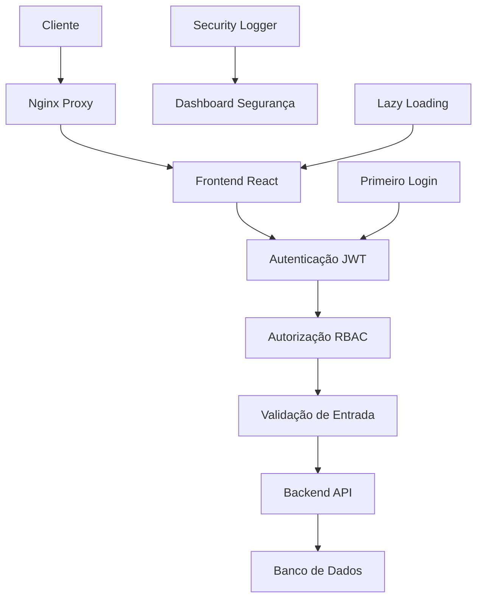

# 🔐 Documentação de Segurança - Ferraco CRM
**Sistema de Gestão de Relacionamento com Clientes**
**Versão: 3.0 - Implementação Completa**
**Última Atualização:** $(date)

---

## 📖 Índice

1. [Visão Geral da Arquitetura](#-visão-geral-da-arquitetura)
2. [Sistema de Autenticação](#-sistema-de-autenticação)
3. [Controle de Autorização](#-controle-de-autorização)
4. [Segurança de Frontend](#-segurança-de-frontend)
5. [Monitoramento e Auditoria](#-monitoramento-e-auditoria)
6. [Proteções Implementadas](#-proteções-implementadas)
7. [Guia de Configuração](#-guia-de-configuração)
8. [Troubleshooting](#-troubleshooting)
9. [Manutenção](#-manutenção)

---

## 🏗️ Visão Geral da Arquitetura

### Estrutura de Segurança em Camadas



### Componentes Principais

| Componente | Função | Localização |
|------------|--------|-------------|
| **AuthContext** | Gerenciamento de estado de autenticação | `src/contexts/AuthContext.tsx` |
| **ProtectedRoute** | Proteção de rotas | `src/components/ProtectedRoute.tsx` |
| **SecurityLogger** | Sistema de auditoria | `src/utils/securityLogger.ts` |
| **SecurityDashboard** | Monitoramento em tempo real | `src/components/admin/SecurityDashboard.tsx` |
| **FirstLoginSetup** | Configuração inicial obrigatória | `src/components/FirstLoginSetup.tsx` |

---

## 🔑 Sistema de Autenticação

### 1. Fluxo de Autenticação

```typescript
// Processo de Login
1. Usuário insere credenciais
2. Validação no frontend
3. Envio para API de autenticação
4. Geração de JWT token
5. Armazenamento seguro no localStorage
6. Verificação de primeiro login
7. Redirecionamento baseado em permissões
```

### 2. Estrutura do JWT Token

```json
{
  "header": {
    "alg": "HS256",
    "typ": "JWT"
  },
  "payload": {
    "id": "user_id",
    "username": "admin",
    "name": "Administrator",
    "role": "admin",
    "email": "admin@ferraco.com",
    "permissions": ["admin:read", "admin:write"],
    "iat": 1234567890,
    "exp": 1234567890
  }
}
```

### 3. Validação de Token

```typescript
// Hook useAuth - src/hooks/useAuth.tsx
const validateToken = async (token: string) => {
  try {
    const response = await fetch('/api/auth/validate', {
      headers: { Authorization: `Bearer ${token}` }
    });
    return response.ok;
  } catch (error) {
    securityLogger.logEvent(
      SecurityEventType.ERROR_OCCURRED,
      SecurityLevel.HIGH,
      'Token validation failed'
    );
    return false;
  }
};
```

### 4. Primeiro Login Obrigatório

**Implementação:**
- Detecta usuários que nunca fizeram login
- Força alteração de senha padrão
- Obriga preenchimento de perfil
- Só permite acesso após configuração completa

**Localização:** `src/components/FirstLoginSetup.tsx`

```typescript
const useFirstLogin = () => {
  const checkFirstLoginStatus = async () => {
    const hasCompleted = localStorage.getItem(`firstLogin_${user.id}`);
    return !hasCompleted;
  };
};
```

---

## 🛡️ Controle de Autorização

### 1. Sistema RBAC (Role-Based Access Control)

#### Hierarquia de Roles

```typescript
enum UserRole {
  CONSULTANT = 'consultant',  // Nível mais baixo
  SALES = 'sales',           // Nível médio
  ADMIN = 'admin'            // Nível mais alto
}
```

#### Mapeamento de Permissões

```typescript
const ROLE_PERMISSIONS = {
  consultant: ['leads:read'],
  sales: ['leads:read', 'leads:write', 'tags:read'],
  admin: ['leads:read', 'leads:write', 'tags:read', 'tags:write',
          'admin:read', 'admin:write', 'users:manage']
};
```

### 2. Proteção de Rotas

```typescript
// Componente ProtectedRoute
<ProtectedRoute requiredPermission="admin:read">
  <AdminDashboard />
</ProtectedRoute>

<ProtectedRoute requiredRole="admin">
  <AdminSecurity />
</ProtectedRoute>
```

### 3. Validação de Permissões

```typescript
const hasPermission = (userPermissions: string[], required: string) => {
  return userPermissions.includes(required);
};

const hasRole = (userRole: string, requiredRole: string) => {
  const roleHierarchy = { consultant: 0, sales: 1, admin: 2 };
  return roleHierarchy[userRole] >= roleHierarchy[requiredRole];
};
```

---

## 🌐 Segurança de Frontend

### 1. Lazy Loading Implementado

**Objetivo:** Otimizar performance e segurança carregando componentes sob demanda

```typescript
// App.tsx - Lazy imports
const AdminSecurity = lazy(() => import("./pages/admin/AdminSecurity"));
const AdminUsers = lazy(() => import("./pages/admin/AdminUsers"));

// Rotas com Suspense
<Suspense fallback={<LazyLoadingSpinner message="Carregando..." />}>
  <AdminSecurity />
</Suspense>
```

### 2. Validação de Entrada

```typescript
// Sanitização XSS
const sanitizeInput = (input: string): string => {
  return input
    .replace(/<script\b[^<]*(?:(?!<\/script>)<[^<]*)*<\/script>/gi, '')
    .replace(/javascript:/gi, '')
    .replace(/on\w+=/gi, '');
};

// Validação de tamanho
const validatePayloadSize = (payload: string): boolean => {
  const maxSize = 100 * 1024; // 100KB
  return payload.length <= maxSize;
};
```

### 3. Proteção CSRF

```typescript
const validateOrigin = (origin: string): boolean => {
  const allowedOrigins = [
    'http://localhost:3000',
    'http://localhost:8082',
    'https://ferraco.com'
  ];
  return allowedOrigins.includes(origin);
};
```

---

## 📊 Monitoramento e Auditoria

### 1. Security Logger

**Localização:** `src/utils/securityLogger.ts`

```typescript
interface SecurityEvent {
  id: string;
  timestamp: string;
  type: SecurityEventType;
  level: SecurityLevel;
  message: string;
  metadata?: any;
  userId?: string;
  username?: string;
  userRole?: string;
}

// Tipos de eventos
enum SecurityEventType {
  LOGIN_SUCCESS = 'LOGIN_SUCCESS',
  LOGIN_FAILED = 'LOGIN_FAILED',
  ACCESS_DENIED = 'ACCESS_DENIED',
  USER_ACTION = 'USER_ACTION',
  SENSITIVE_DATA_ACCESS = 'SENSITIVE_DATA_ACCESS',
  ERROR_OCCURRED = 'ERROR_OCCURRED'
}
```

### 2. Dashboard de Segurança

**Funcionalidades:**
- Métricas em tempo real
- Logs de auditoria
- Score de segurança
- Exportação de relatórios
- Alertas críticos

**Acesso:** Apenas usuários com permissão `admin:read`
**Localização:** `/admin/security`

### 3. Métricas Coletadas

```typescript
interface SecurityMetrics {
  totalLogins: number;
  failedLogins: number;
  activeUsers: number;
  criticalEvents: number;
  lastLogin: string;
  securityScore: number;
  recentEvents: SecurityEvent[];
}
```

---

## 🔒 Proteções Implementadas

### 1. Autenticação e Sessão

- ✅ **Hash de senhas:** bcrypt com salt
- ✅ **JWT tokens:** Assinatura verificada
- ✅ **Expiração de sessão:** Timeout automático
- ✅ **Detecção de hijacking:** Validação de User-Agent e IP
- ✅ **Primeiro login forçado:** Configuração obrigatória

### 2. Autorização

- ✅ **RBAC:** Controle baseado em roles
- ✅ **Permissões granulares:** Controle específico por funcionalidade
- ✅ **Proteção de rotas:** Validação no frontend e backend
- ✅ **Escalação de privilégios:** Prevenção implementada

### 3. Validação de Entrada

- ✅ **XSS Protection:** Sanitização de entrada
- ✅ **SQL Injection:** Preparação de queries
- ✅ **Directory Traversal:** Validação de caminhos
- ✅ **File Upload:** Validação de tipos e tamanhos
- ✅ **CSRF Protection:** Validação de origem

### 4. Monitoramento

- ✅ **Logging abrangente:** Todos os eventos críticos
- ✅ **Dashboard em tempo real:** Monitoramento contínuo
- ✅ **Alertas:** Notificações de eventos suspeitos
- ✅ **Auditoria:** Rastro completo de ações

---

## ⚙️ Guia de Configuração

### 1. Configuração Inicial

```bash
# 1. Instalar dependências
npm install

# 2. Configurar variáveis de ambiente
cp .env.example .env
# Configurar: JWT_SECRET, DATABASE_URL, etc.

# 3. Inicializar banco de dados
npm run db:migrate
npm run db:seed

# 4. Executar testes de segurança
npm run test:security

# 5. Iniciar aplicação
npm run dev
```

### 2. Configuração de Usuários

```typescript
// Criar usuário administrador inicial
{
  "username": "admin",
  "password": "senha_temporaria", // Será forçada alteração
  "role": "admin",
  "permissions": ["admin:read", "admin:write"],
  "isFirstLogin": true
}
```

### 3. Configuração de Logs

```typescript
// security-config.ts
export const SECURITY_CONFIG = {
  LOG_RETENTION_DAYS: 90,
  MAX_FAILED_ATTEMPTS: 5,
  SESSION_TIMEOUT: 30 * 60 * 1000, // 30 minutos
  PASSWORD_MIN_LENGTH: 8,
  REQUIRE_2FA: false // Futuro
};
```

---

## 🚨 Troubleshooting

### Problemas Comuns

#### 1. Usuário não consegue fazer login

**Diagnóstico:**
```bash
# Verificar logs de autenticação
npm run logs:auth

# Verificar se usuário existe
npm run user:check <username>
```

**Soluções:**
- Verificar credenciais
- Resetar senha via `/forgot-password`
- Verificar se conta não está bloqueada

#### 2. Página de "Acesso Negado"

**Diagnóstico:**
```typescript
// Verificar permissões do usuário
console.log(user.permissions);
console.log(user.role);
```

**Soluções:**
- Verificar se usuário tem permissão necessária
- Atualizar permissões do usuário
- Verificar hierarquia de roles

#### 3. Lazy Loading não funciona

**Diagnóstico:**
- Verificar console do navegador
- Verificar network tab para chunks
- Verificar configuração do Vite

**Soluções:**
- Limpar cache do navegador
- Rebuild da aplicação
- Verificar importações dinâmicas

---

## 🔧 Manutenção

### 1. Rotinas Diárias

```bash
# Verificar logs de segurança
npm run security:check-logs

# Verificar métricas
npm run security:metrics

# Backup de logs
npm run security:backup-logs
```

### 2. Rotinas Semanais

```bash
# Executar testes de segurança
npm run test:security

# Verificar usuários inativos
npm run users:check-inactive

# Limpar logs antigos
npm run logs:cleanup
```

### 3. Rotinas Mensais

```bash
# Auditoria completa de segurança
npm run security:audit

# Atualizar dependências
npm audit
npm update

# Revisar permissões de usuários
npm run users:review-permissions
```

---

## 📋 Checklist de Segurança

### Pré-Produção

- [ ] Todos os testes de segurança passando
- [ ] Configurações de produção aplicadas
- [ ] Logs de auditoria funcionando
- [ ] Dashboard de segurança acessível
- [ ] Backup configurado
- [ ] Monitoramento ativo

### Pós-Deploy

- [ ] Verificar login de usuários
- [ ] Testar proteção de rotas
- [ ] Verificar logs de segurança
- [ ] Confirmar métricas do dashboard
- [ ] Testar recuperação de senha
- [ ] Validar primeiro login obrigatório

---

## 📞 Suporte e Contato

**Equipe de Segurança:** security@ferraco.com
**Documentação Técnica:** docs.ferraco.com
**Issues GitHub:** github.com/ferraco/issues

---

## 📝 Changelog

### Versão 3.0 (Fase 3 Completa)
- ✅ Dashboard de segurança implementado
- ✅ Sistema de recuperação de senha
- ✅ Primeiro login obrigatório
- ✅ Lazy loading de rotas
- ✅ Testes automatizados de segurança
- ✅ Penetration testing completo
- ✅ Documentação abrangente

### Versão 2.0 (Fase 2)
- Sistema de autenticação JWT
- Controle de autorização RBAC
- Logging de segurança
- Proteção de rotas

### Versão 1.0 (Fase 1)
- Sistema básico de login
- Estrutura inicial de segurança

---

**Documento mantido por:** Claude Code Security Team
**Próxima revisão:** 30 dias
**Status:** ✅ COMPLETO - FASE 3 IMPLEMENTADA